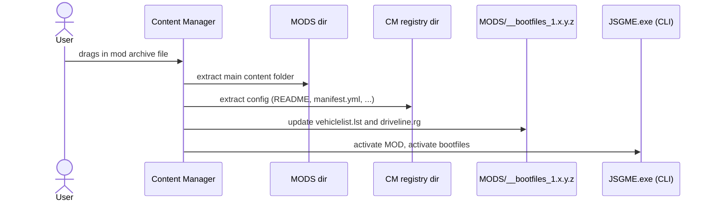
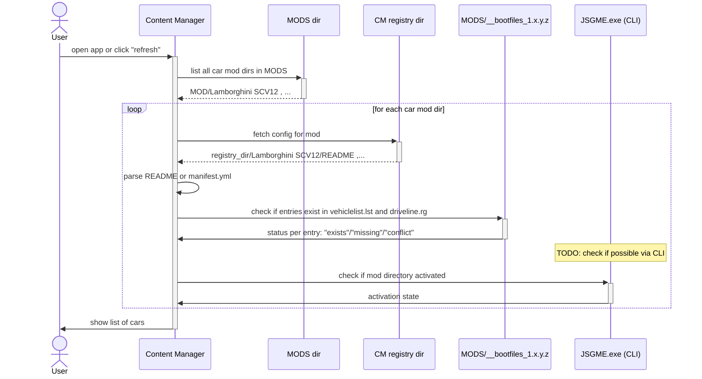
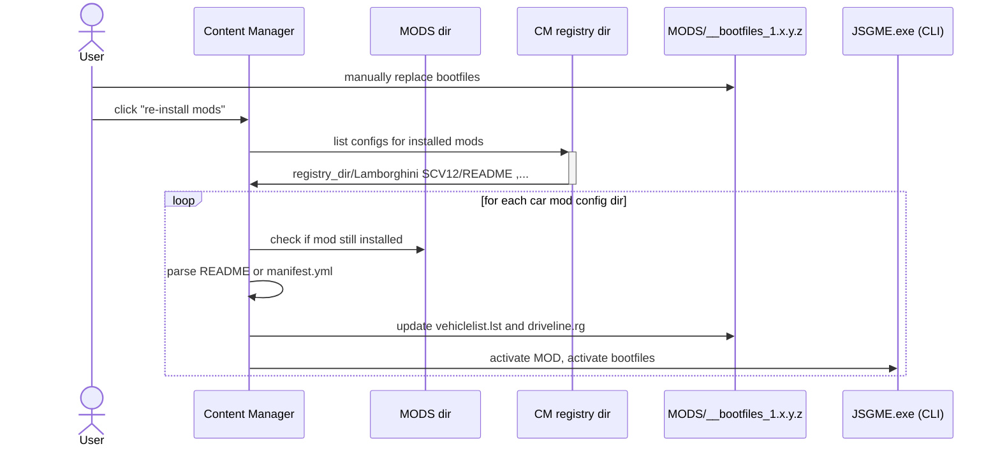

# Use cases

## 1. Install mod from archive

_As an AMS2 user, I want to install a downloaded car mod with a view clicks so I don't need to deal with extracting files, copying files, and manually updating config files._

## 2. View installed mods

_As an AMS2 user, I want to view a list of installed mods so I can get an overview and take further action for selected mods._

## 3. Re-install mods after game update

_As an AMS2 user, I want to re-install my existing mods with a few clicks
so I don't need to manuall re-run the installation process for each mod._

